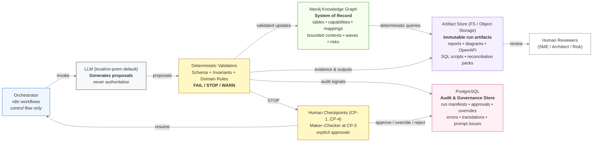

# Governed AI Architecture

This repository documents a **decision-first reference architecture** for building AI-assisted systems that are **safe enough to act on** in regulated environments.

The focus is not on models, prompts, or benchmarks.

It is on the **architectural decisions** required to make AI outputs:
- auditable,
- reproducible,
- governable,
- and resilient to probabilistic failure.

This work is developed **in the open**. Decisions evolve, but they do so explicitly and traceably.

---

## What this repository is

- A reference architecture for **governed AI systems**
- A concrete exploration of **trust engineering**
- A curated system of **Architecture Decision Records (ADRs)**

The architecture assumes:
- AI outputs are probabilistic,
- production systems require determinism,
- and trust must be engineered, not asserted.

---

## What this repository is not

- Not a framework
- Not a product
- Not a demo
- Not optimized for quick wins

There is no "run this to get magic."

---

## Architecture at a glance

> LLMs produce proposals.  
> Truth lives in the graph.  
> Everything progresses through deterministic validation and auditable human checkpoints.

See [`docs/diagrams/authority-boundaries.mmd`](./docs/diagrams/authority-boundaries.mmd)

---

## How to read this repository

1. Start with the **architecture decisions**  
   → [`docs/decisions/`](./docs/decisions/)

2. Read **ADR-000** to understand scope and stance.

3. Skim other ADRs by concern (trust, execution, governance, learning).

4. Treat all code as **supporting artifacts**, not sources of truth.

---

## Status

This is a **work in progress**.

Architectural principles are stable.  
Decisions may be refined or superseded.  
Nothing changes silently.

---

## Context

This work is accompanied by a public article series exploring the reasoning behind these decisions:

- [Designing Target Architecture with AI — An ADR-Driven Approach](https://www.linkedin.com/pulse/designing-target-architecture-ai-adr-driven-approach-korsholm-3yvxe)
- [Why Trustworthy AI Is an Architecture Problem, Not a Model Problem](https://www.linkedin.com/pulse/why-trustworthy-ai-architecture-problem-model-stig-pedersen-korsholm-wmlje)
- [Why the Knowledge Model Must Be a Graph (and What Breaks When It Isn't)](https://www.linkedin.com/pulse/why-knowledge-model-must-graph-what-breaks-when-isnt-korsholm-6zzte)

---

## Author

**Stig Pedersen Korsholm**  
Lead Domain Architect  
[LinkedIn](https://www.linkedin.com/in/stigkorsholm)
